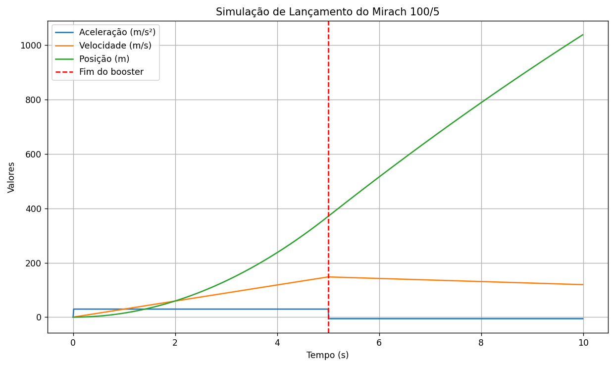

# Mirach-100/5-launch-simulation

Simulação física em Python do lançamento do drone-alvo italiano Mirach 100/5.
1. Identificação Geral
•	Nome: Mirach 100/5
•	Categoria: Drone-alvo (target drone)
•	Origem: Itália (ITA)
________________________________________

2. Fabricantes e Período de Produção
Período	Fabricante
1998 – 2003	Meteor SpA Costruzioni Aeronautiche ed Elettroniche (Ronchi dei Legionari)
2003 – 2013	Galileo Avionica SpA (Ronchi dei Legionari)
2013 – 2015	Selex ES SpA (Ronchi dei Legionari)
2016 – presente (20RR)	Finmeccanica SpA (Ronchi dei Legionari)
Nota: “20RR” parece indicar que a produção continuava ativa em 2020 ou além disso.
________________________________________

3. Características Gerais
•	Primeiro voo: dezembro de 1996
•	Configuração da asa: monoplano
•	Conceito da aeronave: convencional
•	Trem de pouso: não possui
•	Decolagem/pouso: por catapulta ou plataforma de lançamento; recuperação por paraquedas
________________________________________

4. Dimensões
Parâmetro	Medida
Envergadura (wingspan)	7 ft 6 ½ in (~2,30 m)
Comprimento (length)	13 ft 4 ¼ in (~4,07 m)
Altura (height)	2 ft 11 in (~0,89 m)
Área da asa (wing area)	11,84 ft² (~1,1 m²)
Peso máximo de decolagem	838 lb (~380 kg)
Peso vazio	Não informado (estimado)
________________________________________

5. Propulsão
•	Tipo de motor: turbojato (turbojet)
•	Quantidade: 1 motor + 2 foguetes auxiliares
•	Motor principal:
o	Modelo: Microturbo TRS 18-1-201-1
o	Empuxo: 353 lbf (~1,57 kN)
•	Foguetes auxiliares: 2 boosters (sem especificação técnica)
________________________________________

6. Desempenho
Parâmetro	Valor
Velocidade máxima	559 mph (~900 km/h)
Teto operacional (ceiling)	39.370 pés (~12.000 m)
Autonomia (endurance)	1,5 h
Velocidade de cruzeiro	Não informada
Alcance máximo	Não informado
________________________________________

7. Equipamentos Especiais
O Mirach 100/5 é equipado com um conjunto de sistemas para simulação de ameaças e contramedidas:
•	Flares rastreadores de fumaça
•	Flares rastreadores infravermelhos
•	"Hot nose" (provavelmente simulador térmico para IR)
•	Lançadores de chaff e decoys IR/radar
•	Aumentadores de radar (radar augmenters)
•	Radar MDI
•	2 alvos rebocados (tow targets)
________________________________________

8. Armamento
•	Nenhum armamento letal: o Mirach 100/5 é um drone-alvo, usado para simular aeronaves inimigas em exercícios militares.
________________________________________

9. Estados Usuários
•	Informação não especificada no documento. Possivelmente utilizado por forças armadas da Itália e outros países da OTAN.
________________________________________

10. Referências Bibliográficas
•	Jane’s Unmanned Aerial Vehicles and Targets – Kenneth Munson, Jane’s Information Group, 2005. ISBN: 0-7106-1257-5.
•	Leonardo S.p.A.:
o	leonardo.com
o	electronics.leonardo.com
•	Outras fontes:
o	aviationsmilitaires.net
o	armedconflicts.com
________________________________________

Observações Finais
O Mirach 100/5 é um drone de alta performance usado para treinamento de defesa aérea, incluindo simulações de mísseis, testes de sensores e artilharia antiaérea. 
Sua configuração com propulsão turbojato e boosters auxiliares oferece alto desempenho e versatilidade, sendo uma plataforma importante na simulação de ameaças em ambientes complexos.

